# Camunda-Robotframework-Workshop

Welcome to the Workshop: "Orchestrating Robot Tasks with Camunda Platform". The workshop is hold at Robocon 2022. But you can follow the exercises here as well. The README contains the detailed instruction on how to complete the exercises. In the solution folder you find for every exercise the solution and detailed instructions. The solution normally contains the bpmn process model, code (Robotframework and Python) and a README that explained how the exercise was solved in more detail. 


**:toolbox: Everything needed for the workshop:**

- [Docker](https://docs.docker.com/get-docker/)
- [Camunda Modeler](https://camunda.com/download/modeler/)
- [Python](https://www.python.org/downloads/)
- [Camunda Python 3 External Task client](https://github.com/camunda-community-hub/camunda-external-task-client-python3)   
- [Robotframework](https://pypi.org/project/robotframework/)
- Robotframework-Camunda- Library
- Selenium Libary
- IDE of your choice

:exclamation:  Please note that the exercises build up on each other. You are always welcome to use the provided solution and continue from there. When a tool is needed for the first time it will be mentioned in the exercise again.


## Exercise 1: Set up a Camunda application using Docker
:trophy: The goal of this exercise is to create a running Camunda instance with Docker and to inspect the examples in Cockpit

:toolbox: **Tools needed**:  
- [Docker](https://docs.docker.com/get-docker/)

### Run Camunda with Docker

[Camunda provides a Docker imagine](https://github.com/camunda/docker-camunda-bpm-platform#camunda-platform-docker-images). Start a Docker container of the latest Camunda Platform 7 release:

```
docker pull camunda/camunda-bpm-platform:latest
docker run -d --name camunda -p 8080:8080 camunda/camunda-bpm-platform:latest
```

    

 -------------------------  
:pushpin: Note:

Once you started the container you will see the container id:

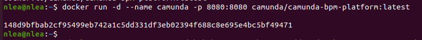

If you like to stop the container you can use```docker stop 'ContainerId'``` or ```docker stop 'Container name'```

-------------------------


 ### Cockpit and running process instances
 

Once you started the Docker container, Camunda is started in a Tomcat application server. You can access the Camunda's Frontend applications via: http://localhost:8080/camunda-welcome/index.html

Select Cockpit and log in with the default credentials: 
```
username: demo
password: demo
```
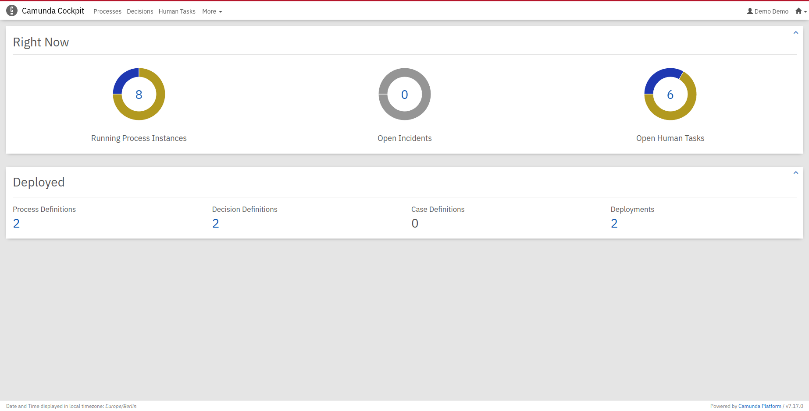

Cockpit is the tool to monitor and operate running process instances in Camunda. You can see that there are already two process definitions deployed and 8 running process instances. Click on the 8 running process instances. Select the invoice process: 

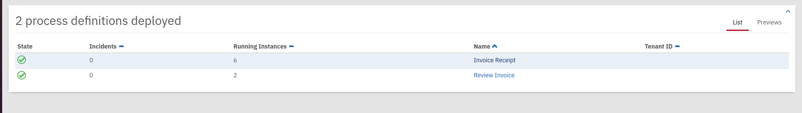

A running process instances is represented with a blue token: 

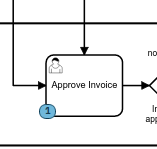

Inspect a instance and see what information you can access. Feel free to play around in Cockpit and get familar with it. 

:tada: Congrats you have a Camunda application running and inspected the two deployed example process definitions in Cockpit


## Exercise 2: Model a process and add it to your application

:trophy: The goal of this exercise is to create a process and deploy it to your running Camunda application. 

:toolbox: **Tools needed**:
- [Camunda Modeler](https://camunda.com/download/modeler/)

### Process Description

Imagine you start your day at Robocon: You need coffee! 

Before you order your coffee you fill out a [survey](https://www.buzzfeed.com/rileyroach/which-coffee-are-you-572dyo73ow) to find out what kind of coffee you are most like. The next step is to get all the ingrients for the defined coffee type. Once you have the ingrients you can prepare the coffee. Once your coffee is ready you want to tweet about it before you finally drink it. 

Model a BPMN process model from that description in the Camunda Modeler. Hint: You can find a solution [here](Solutions/02).

### Task types: user task

Once you have your process model make sure that all task types are user tasks. Change them in the Camunda Modeler.

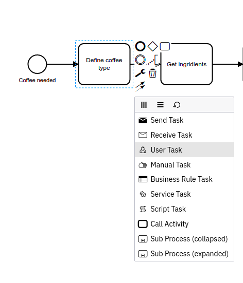

### Properties panel: technical attributes on general level

In the Camunda Modeler click into the canvas and make sure that you have not selected a bpmn symbol. Now have a look on the right side at the properties pannel. The properties panel is used to set technical attributes for symbols and the process. 

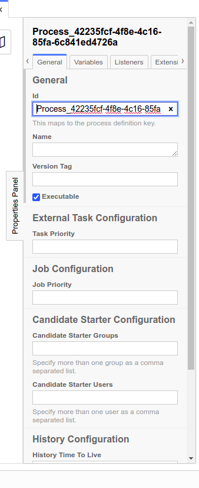

Give your process a readable ID (something like: ```Process_getCoffee```) and a readable name (something like: ```Get Coffee Process```). 

:bulb: **Good to know:** 
- The process ID is used to version your process definitions. The Camunda engine takes care about the versioning.
- The name will show up in Cockpit. If no name is defined the processID will show up instead

### Deploy the process

Now you can deploy the process Model from the Camunda Modeler to your running Camunda instance. In the left corner of the modeler you find a :rocket: symbol:

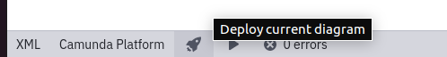

Select it: 

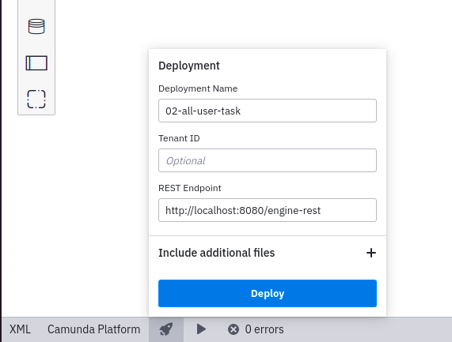

The default REST endpoint is localhost:8080. As we started our Docker image at that port. We don't have to change it

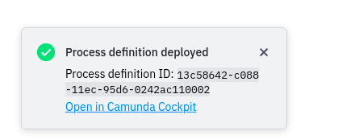

Inspect your process in Cockpit. If you have problems with your deployment check out [this section](https://github.com/Nlea/Camunda-Robotframework-Workshop/blob/main/Solutions/02/README.md#problems-with-the-deployment).

### Run a process instance and step through the process using Tasklist

Now it is time to learn more about Tasklist. Tasklist is a Camunda Frontend application that presents a UI for a User Task. Further you can start processes from there. Go back to Cockpit in your browser.In Camunda you can naviagte between the different Frontend applications using the little house symbole in the upper right corner. Open Tasklist in a new tab:

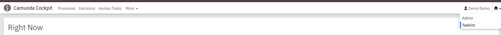

The first think we want to do is to start a process instance of our deployed model. Select the "start process"- button and choose the name of your deployed diagram: 

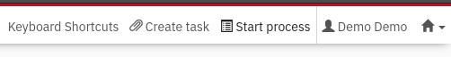

Let's have a look at the left side of Tasklist:
1. You can filter tasks. In your list you can already see some predefined filters for the example process. Select the filter all tasks
2. In this collumn you can see all tasks that match to the filter. You should see now the task from your "Get Coffee Process" on top. Select it
3. This part shows the form attached to the User Task. We haven't defined any form yet. So no nothing to display here. 
4. Before a task can be completed a user has to claim the task. Claim the task
5. Afterwards you can complete it 

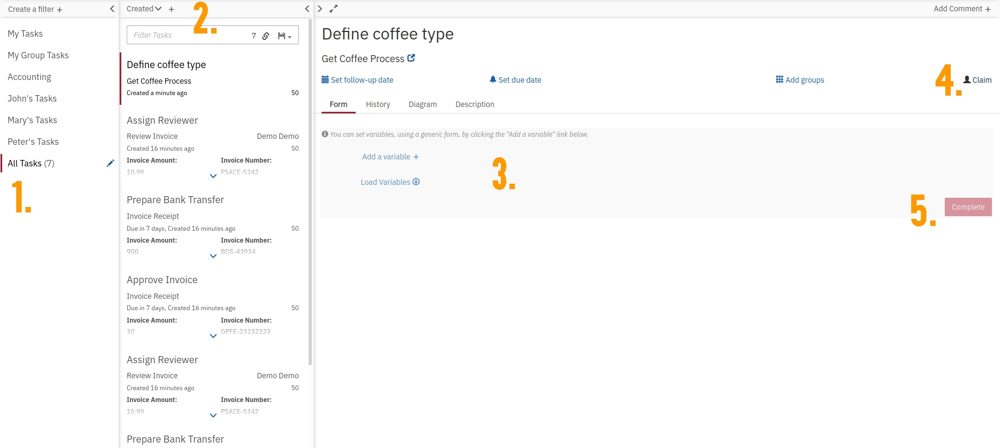


Do that for all tasks in your process and observe how the instance moves in Cockpit


:star2: **Opitional task**:  
- Start a process instance using the Camunda Modeler
- Start a process instance using Camunda's REST API


## Exercise 3: Implement a Service Task: Combing the Pyhton External Task client and Robotframework
:trophy: The goal of this exercise is to connect a Robotframework Task to the process using Python. 

:toolbox: **Tools needed**:
- [Python 3](https://www.python.org/downloads/)
- A package installer like [pip](https://pypi.org/project/pip/) can be handy
- [The Camunda External Task client Python3](https://github.com/camunda-community-hub/camunda-external-task-client-python3) installing with pip: ```pip install camunda-external-task-client-python3 ```
- [Robotframework](https://pypi.org/project/robotframework/) installing with pip: ```pip install robotframework ``` A more detailed description can be found [here](https://github.com/robotframework/robotframework/blob/master/INSTALL.rst)
- [Selenium Library](https://github.com/robotframework/SeleniumLibrary)

### Bulding a Robotframework Task

We want to build a UI automation for the [website](https://www.buzzfeed.com/rileyroach/which-coffee-are-you-572dyo73ow) that defines the coffee type. The Robot should random choose for each question a random answer.

In order to build the Robot we use Selenium. 


## Exercise 4: Implement a Services: Using the Camunda-Robotframework library

## Exercise 5: Adding BPMN events to the process

## Exercise 6: Throwing BPMN errors in Robotframework
