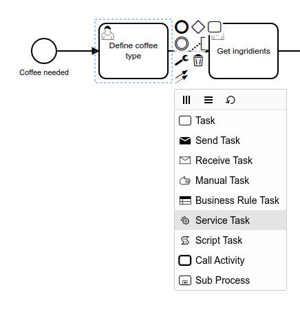
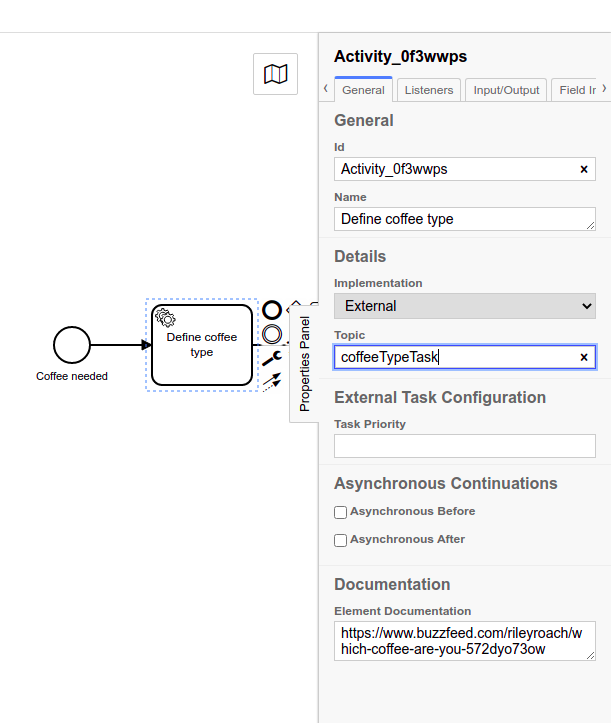

# Camunda-Robotframework-Workshop

Welcome to the Workshop: "Orchestrating Robot Tasks with Camunda Platform". The workshop is hold at Robocon 2022. But you can follow the exercises here as well. The README contains the detailed instruction on how to complete the exercises. In the solution folder you find for every exercise the solution and detailed instructions. The solution normally contains the bpmn process model, code (Robotframework and Python) and a README that explained how the exercise was solved in more detail. 


**:toolbox: Everything needed for the workshop:**

- [Docker](https://docs.docker.com/get-docker/)
- [Camunda Modeler](https://camunda.com/download/modeler/)
- [Python](https://www.python.org/downloads/)
- [Camunda Python 3 External Task client](https://github.com/camunda-community-hub/camunda-external-task-client-python3)   
- [Robotframework](https://pypi.org/project/robotframework/)
- Robotframework-Camunda- Library
- Selenium Libary
- IDE of your choice

:exclamation:  Please note that the exercises build up on each other. You are always welcome to use the provided solution and continue from there. When a tool is needed for the first time it will be mentioned in the exercise again.


## Exercise 1: Set up a Camunda application using Docker
:trophy: The goal of this exercise is to create a running Camunda instance with Docker and to inspect the examples in Cockpit

:toolbox: **Tools needed**:  
- [Docker](https://docs.docker.com/get-docker/)

### Run Camunda with Docker

[Camunda provides a Docker imagine](https://github.com/camunda/docker-camunda-bpm-platform#camunda-platform-docker-images). Start a Docker container of the latest Camunda Platform 7 release:

```
docker pull camunda/camunda-bpm-platform:latest
docker run -d --name camunda -p 8080:8080 camunda/camunda-bpm-platform:latest
```

    

 -------------------------  
:pushpin: Note:

Once you started the container you will see the container id:


If you like to stop the container you can use```docker stop 'ContainerId'``` or ```docker stop 'Container name'```

-------------------------


 ### Cockpit and running process instances
 

Once you started the Docker container, Camunda is started in a Tomcat application server. You can access the Camunda's Frontend applications via: http://localhost:8080/camunda-welcome/index.html

Select Cockpit and log in with the default credentials: 
```
username: demo
password: demo
```


Cockpit is the tool to monitor and operate running process instances in Camunda. You can see that there are already two process definitions deployed and 8 running process instances. Click on the 8 running process instances. Select the invoice process: 


A running process instances is represented with a blue token: 


Inspect a instance and see what information you can access. Feel free to play around in Cockpit and get familar with it. 

:tada: Congrats you have a Camunda application running and inspected the two deployed example process definitions in Cockpit


  
## Exercise 2: Model a process and add it to your application

:trophy: The goal of this exercise is to create a process and deploy it to your running Camunda application. 

:toolbox: **Tools needed**:
- [Camunda Modeler](https://camunda.com/download/modeler/)

### Process Description

Imagine you start your day at Robocon: You need coffee! 

Before you order your coffee you fill out a [survey](https://www.buzzfeed.com/rileyroach/which-coffee-are-you-572dyo73ow) to find out what kind of coffee you are most like. The next step is to get all the ingrients for the defined coffee type. Once you have the ingrients you can prepare the coffee. Once your coffee is ready you want to tweet about it before you finally drink it. 

Model a BPMN process model from that description in the Camunda Modeler. Hint: You can find a solution [here](Solutions/02).

### Task types: user task

Once you have your process model make sure that all task types are user tasks. Change them in the Camunda Modeler.


### Properties panel: technical attributes on general level

In the Camunda Modeler click into the canvas and make sure that you have not selected a bpmn symbol. Now have a look on the right side at the properties pannel. The properties panel is used to set technical attributes for symbols and the process. 


Give your process a readable ID (something like: ```Process_getCoffee```) and a readable name (something like: ```Get Coffee Process```). 

:bulb: **Good to know:** 
- The process ID is used to version your process definitions. The Camunda engine takes care about the versioning.
- The name will show up in Cockpit. If no name is defined the processID will show up instead

### Deploy the process

Now you can deploy the process Model from the Camunda Modeler to your running Camunda instance. In the left corner of the modeler you find a :rocket: symbol:


Select it: 


The default REST endpoint is localhost:8080. As we started our Docker image at that port. We don't have to change it


Inspect your process in Cockpit. If you have problems with your deployment check out [this section](https://github.com/Nlea/Camunda-Robotframework-Workshop/blob/main/Solutions/02/README.md#problems-with-the-deployment).

### Run a process instance and step through the process using Tasklist

Now it is time to learn more about Tasklist. Tasklist is a Camunda Frontend application that presents a UI for a User Task. Further you can start processes from there. Go back to Cockpit in your browser.In Camunda you can naviagte between the different Frontend applications using the little house symbole in the upper right corner. Open Tasklist in a new tab:


The first think we want to do is to start a process instance of our deployed model. Select the "start process"- button and choose the name of your deployed diagram: 


Let's have a look at the left side of Tasklist:


1. You can filter tasks. In your list you can already see some predefined filters for the example process. Select the filter all tasks
2. In this collumn you can see all tasks that match to the filter. You should see now the task from your "Get Coffee Process" on top. Select it
3. This part shows the form attached to the User Task. We haven't defined any form yet. So no nothing to display here. 
4. Before a task can be completed a user has to claim the task. Claim the task
5. Afterwards you can complete it 


Do that for all tasks in your process and observe how the instance moves in Cockpit

----------------------------------------------------------------
:star2: **Opitional task**:  
- Start a process instance using the Camunda Modeler
- Start a process instance using [Camunda's REST API](https://docs.camunda.org/manual/latest/reference/rest/process-definition/post-start-process-instance/)
- Use the REST API to [get](https://docs.camunda.org/manual/latest/reference/rest/task/get/) a task id. With the id you can [claim](https://docs.camunda.org/manual/latest/reference/rest/task/post-claim/) and [complete](https://docs.camunda.org/manual/latest/reference/rest/task/post-complete/) user tasks


:pushpin: Note:
For this optional task it is useful to use a tool like [Postman](https://www.postman.com/)

--------------------------------------------------------------

:tada: Congrats you have a deployed process with user tasks and stepped through it using Camunda's Tasklist


 
## Exercise 3: Implement a Service Task: Combing the Pyhton External Task client and Robotframework
:trophy: The goal of this exercise is to connect a Robotframework Task to the process using Python and Camunda's [External Task pattern](https://docs.camunda.org/manual/latest/user-guide/ext-client/). 

:toolbox: **Tools needed**:
- [Python 3](https://www.python.org/downloads/)
- A package installer like [pip](https://pypi.org/project/pip/) can be handy
- [The Camunda External Task client Python3](https://github.com/camunda-community-hub/camunda-external-task-client-python3) installing with pip: ```pip install camunda-external-task-client-python3 ```
- [Robotframework](https://pypi.org/project/robotframework/) installing with pip: ```pip install robotframework ``` A more detailed description can be found [here](https://github.com/robotframework/robotframework/blob/master/INSTALL.rst)
- [Selenium Library](https://github.com/robotframework/SeleniumLibrary)

### Bulding a Robotframework Task

We want to add some automation to our process. The first thing we would like to automate is the userinterface interaction with the [coffee quiz](https://www.buzzfeed.com/rileyroach/which-coffee-are-you-572dyo73ow) that defines the coffee type. The Robot should random choose for each question one of the six answer posibilities. 

Add one folder to your project for the Coffee Quiz Task. Within that folder create a ```task.robot``` file.In order to build the Robot we use Selenium. You can either decide to try out to build the Robotframework task yourself or use our solution from [here](/Solutions/03/Define Coffee Type Task/task.robot). 

Once you have your Robotframework Task open a Terminal and type the command ```robot task.robot```. 
The robot should run and you should be able to inspect the log.html afterwards. 


### Connecting The task.robot to the bpmn process. 

First thing we do is changing our BPMN model. Change the type of the "define coffee type" task from a user task to a service task in the Camunda Modeler: 



Next we look at the property panel. We are going to implement the Service Task as External Task. Provide a topicname like ```coffeeTypeTask```. 



Deploy the new version of the process and start an instance from the Modeler.

### Connecting a task worker to the Service Task
Next up we need a worker that polls the Camunda engine and fetches the task once it becomes available. We are going to use the [Python 3 External Task Client](https://github.com/camunda-community-hub/camunda-external-task-client-python3). Create a new file in the "Coffee Quiz task" and name it something like ```worker.py```. Open the file in an IDE of your choice. 

```Python
import time
from camunda.external_task.external_task import ExternalTask, TaskResult
from camunda.external_task.external_task_worker import ExternalTaskWorker


def handle_task(task: ExternalTask) -> TaskResult:

   ## Your Business logic goes here

   return task.complete()

ExternalTaskWorker(worker_id="1").subscribe("coffeeTypeTask", handle_task)

```

This is the basic construct in order to create an external task worker in Python. Let's connect our robot.task to it. In Python we can simple use the robot module and the function ```robot.run("task.robot")```. Make sure to import the robot module in the beginning. The function returns a number. Save the number in a variable called ```robotOutput```. If the number is 0 it means the task.robot was executed successful. If it contains a number bigger than 0 it means the robot task was not executed successfully. In that case we want to report to Camunda that there was a problem and add a ``` return task.failure(error_message="RF-task failed",  error_details="The RF task was not completed successfully. For more information open the log.html", 
            max_retries=0, retry_timeout=5000)```. 

Add the described logic to the Python file under the Comment: "Your Business logic goes here". You can find a solution of the full code [here](/Solutions/03/Define Coffee Type Task/worker-without-robotframework-listener.py). 

Now go to Cockpit. We already started an instance. You should see a second version of the process with one instances waiting at the "Define coffee type" task. 

Start the Python worker in your terminal using ```python worker.py```. Observe Cockpit. Stop the worker afterwards.

----------------------------------------------------------------
:star2: **Opitional task**:
- Change something in the task.robot file so the execution of the robot will fail. 
- Start a new process instance (Camunda Modeler, Tasklist or REST API)
- Start up the worker ```python worker.py```
- Observe the incident showing up in Cockpit and inspect it


-------------------------------------------------------------------

### Getting variables from the robot task to Camunda

This is already great. We can run our robot task and communicate to Camunda if the task was successful or not. The only thing is missing is the information about the coffee type... how should the next task "get ingridients" be preformed without that information? 

We can complete tasks in Camunda with handing back variables: ``` return task.complete({"type": coffeeType}) ```. In order to get the information from the robot task we are going to use a [Robotframework listener)(https://robotframework.org/robotframework/latest/RobotFrameworkUserGuide.html#listener-interface). In the folder "Define Coffee task type" create a file called ```listener.py ```: 

```python
from robot.libraries.BuiltIn import BuiltIn

ROBOT_LISTENER_API_VERSION = 2


class getVariablesListener:
  ROBOT_LISTENER_API_VERSION = 2
  def end_test(self, name, attributes):
    self.variables = BuiltIn().get_variables()

```
- Add the listener to your import statements at the top of the ```worker.py```. 

- Create an object and start the robot with the listener:

```
l = listener.getVariablesListener()
robotOutput = robot.run("task.robot", listener=l) 
```

The listener gets the variables from the robot task. Afterwards we can access the variables we are interested in: 

```
coffeeType = l.variables["${result}"]
```
Once you have the variable you can hand it in as parameters with the complete call to Camunda: 
```
task.complete({"type": coffeeType})
```


You can find the full ```worker.py``` file with listener [here](/Solutions/03/Define Coffee Type Task/worker-with-robotframework.listener.py).

Start a new process instance of the process. If you did the optional task before make sure your robot task is error free again. Start the ```worker.py```. 

Go to Cockpit and obsver the process variables from your last started instance. You should be able to see the variable ```type``` . 

:tada: You connected a robot task to Camunda using the Camunda Python External Task client and a Robotframework Listener. 

NOTE: Add Twitter task


## Exercise 4: Implement a Services: Using the Camunda-Robotframework library
:trophy: The goal of this exercise is to connect a Robotframework taskto camunda using the Camunda-Robotframework library

- both service tasks (Get ingridients + Prepare coffee)

## Exercise 5: Routing the process with data and adding a User Interface
- 

## Exercise 6: Adding BPMN events and a User Task form to the process
:trophy: The goal of this exercise is to model BPMN error in your process and add a form to a User Task

### With Python External Task Client

### With Camunda-Robotframework library

- Link zu dem kompletten Projekt


