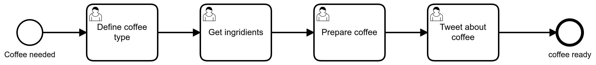

# Solution Exercise 2

## Process Model
 From the description we can model a simple bpmn diagramm containing 4 tasks. We will talk about the task types in the next section. 


 

## User Tasks
 Change all the task to User Task before deploying the process: 

 

 
 ## Problems with the deployment
- Check if you have a Camunda instance running. The deploy dialog from the Camunda Modeler will indicate if the REST endpoint has no running Camunda instance: 


- Do you have other symboles in the process? You can always inspect the log. If you get a ``` 09005 Could not parse BPMN process``` -Error. It is very likely that you used some symboles we have not discussed yet. Some symbols require to add technical attributes. No worries we will cover more symboles in the Workshop. 
